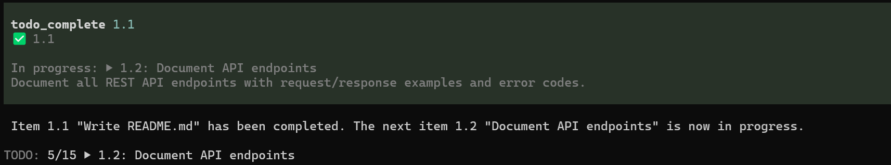
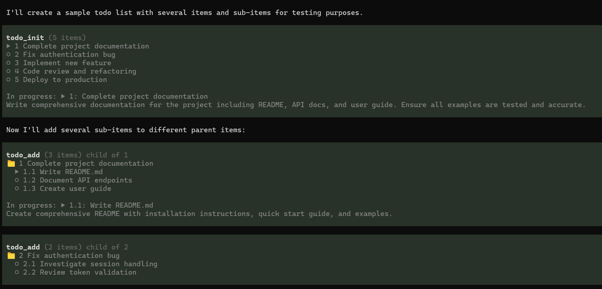
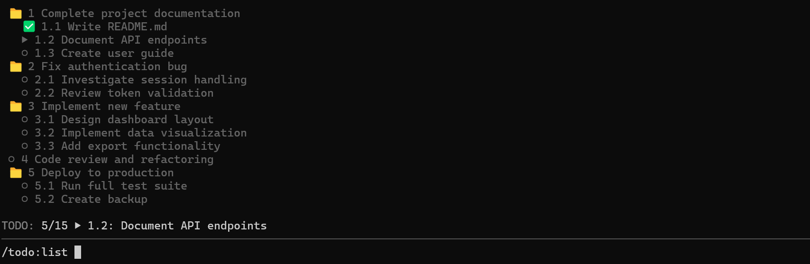
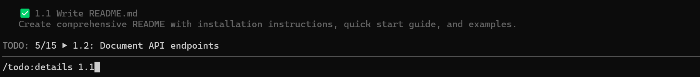
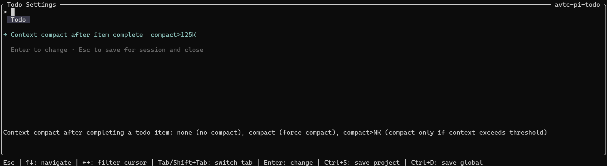

# avtc-pi-todo

A working-memory plan the agent manages — breaks multi-stage work into items when needed, and completing each surfaces the next's details to keep the agent on track.

## Features

- **5 todo tools** — `todo_init`, `todo_add`, `todo_move`, `todo_list`, `todo_complete` for full lifecycle management
- **Hierarchical items** — items can be decomposed into sub-steps (parent becomes a 📁 folder; children are tracked independently)
- **Persistence** — state is saved to the session file after every mutation; survives `/reload` and `/resume` (does NOT survive `/new` by design)
- **TUI footer widget** — renders a summary of the current todo list in the footer; updates on every mutation
- **Context compact after completion** — configurable behavior (none, compact, or compact-above-threshold) after completing an item
- **Subagent support** — the todo tools are force-added into subagent [`avtc-pi-subagent`](https://github.com/avtc/avtc-pi-subagent) sessions.
- **Extensibility** — `pi-todo:ready` event exposes `disableBuiltInFollowUp()`, `getCompletedItemId()`, `getInProgressItem()`, `areAllTodosDone()` for other extensions to integrate with

The footer widget tracks progress and updates on every mutation:



Initialize a list, add items, and decompose into sub-steps:



## Tools

| Tool | Description |
|---|---|
| `todo_init` | Initialize a todo list from a set of named items (the first item auto-starts as `in_progress`) |
| `todo_add` | Add a new item (optionally as a sub-item under a parent) |
| `todo_move` | Reposition an item (before another item, or under a parent) |
| `todo_list` | Read current items, optionally filtered by status/parent |
| `todo_complete` | Mark an item completed; surfaces the next pending item |

## Commands

| Command | Description |
|---|---|
| `/todo:list` | List todo items, optionally filtered by status |
| `/todo:details` | Show full details for a single todo item by ID |
| `/todo:settings` | Open the settings UI |

Browse and inspect items via slash commands:







## Configuration

Settings live in `~/.pi/agent/avtc-pi-todo-settings.json` (global) or `<cwd>/.pi/avtc-pi-todo-settings.json` (project overrides win) and are edited via `/todo:settings`. Requires [`avtc-pi-settings-ui`](https://github.com/avtc/avtc-pi-settings-ui) (installed automatically as a dependency).

| Key | Type | Default | Description |
|-----|------|---------|-------------|
| `todoItemCompleteContextCompact` | string | `"none"` | Context compact after item complete: `"none"` (no compact), `"compact"` (force compact), `"compact>75K"`, `"compact>125K"`, `"compact>200K"`, `"compact>500K"` (compact only if context exceeds threshold) |

## Installation

```bash
pi install npm:avtc-pi-todo
```

> Developed with [Z.ai](https://z.ai/subscribe?ic=N5IV4LLOOV) — get 10% off your subscription via this referral link.

## License

MIT
